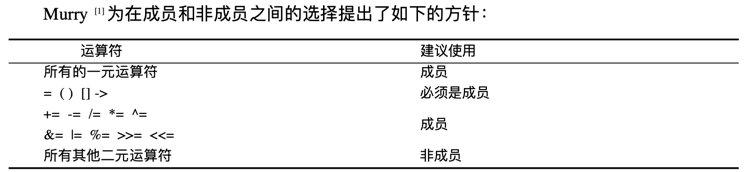

[toc]

# 重载、覆盖、隐藏

| 重载                                                         | 覆盖                                                            | 隐藏 |      
|------------------------------------------------------------|---------------------------------------------------------------|----|    
| <li>同一个作用域<li>函数名相同<li>参数不同<li>返回值可相同可不同<li>virtual关键字可有可无 | <li>不同的范围（分别位于派生类与基类）<li>函数名字相同<li>参数相同 <li>基类函数必须有virtual关键字 |    |

## 重载
