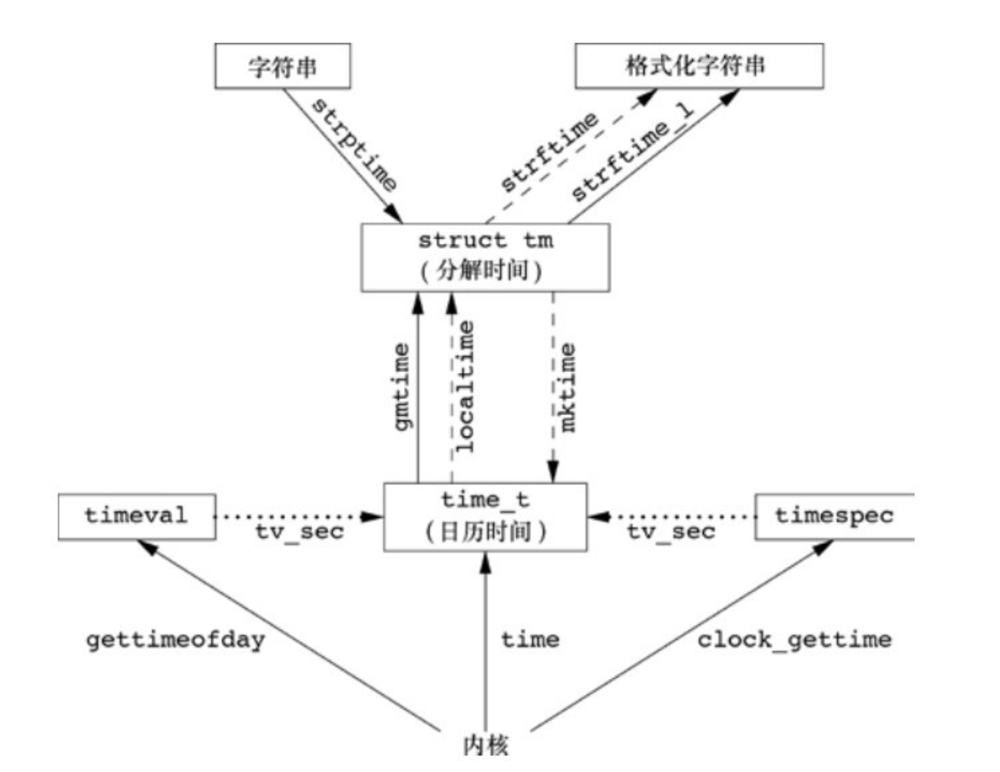

# unix(linux) 时间值

## 日历时间
    该值是自协调世界时（Coordinated Universal Time，UTC）1970年1月1日00:00:00这个特定时间以来所经过的秒数累计值（早期的手册称UTC为格林尼治标准时间）。这些时间值可用于记录文件最近一次的修改时间等。系统基本数据类型time_t用于保存这种时间值

## 进程时间
    又称CPU时间,度量进程使用的中央处理器资源。进程时间以时钟滴答计算。系统基本数据类型clock_t保存这种时间值。一个进程一般有3个进程时间值，分为时钟时间，用户CPU时间，系统CPU时间。用户CPU时间和系统CPU时间之和常被称为CPU时间。
  
- 时钟时间:墙上时钟时间(wall clock time),进程运行时间总量。
- 用户CPU时间:执行用户指令所用的时间量。
- 系统CPU时间:该进程执行内核程序所经历的时间

## 硬件时间
    BIOS时钟，recaltime clock; 
    命令:hwclock show

## 系统时间
    内核时钟（函数调用获取的时间值一般都是只内核时钟[内核时钟是宽泛描述，可精细划分为PHC时钟等]）
    命令:date


# 时间种类
- UTC:协调世界时,1970-01-01
- CST:中国标准时间(china standard time)
- DST:夏令时(daylight saving time)(国内不使用)
- GPS:1980-01-06-00h
- NTP:1900-01-01-00h; (1972-01-01-00 + 2272060800s) ==> UTC
- TAI:1970-01-01,currently ahead of UTC by 37 seconds
# linux用户获取系统时间方式(函数)


## time()
- 头文件:#include <time.h>
- 时间起点是UTC(1970-01-01)
- 返回值精度为秒

## gettimeofday()
- 头文件:#include <sys/time.h>
- 时间起点是UTC(1970-01-01)
- 返回值精度是微妙(通过结构体struct timeval确认)

## clock_gettime()

- 线程安全
- clockid
  - CLOCK_REALTIME:系统时钟，使用date命令确认当前系统时间；但该时间会被NTP和adjtime函数影响
    - chrony会调整NTP，NTP会影响该时钟跳转(频率不确定，没仔细研究)
  - CLOCK_MONOTONIC:单调递增时间，时钟跳转不可修改，但会被频率影响
    - LinuxPTP端口状态进入slave状态会调用类似adjtime(clock_adjtime)函数调整该时钟时间和频率
    - 同样也会被NTP和adjtime函数影响
  - CLOCK_MONOTONIC_RAW:访问的是硬件时间，不会被NTP和adjtime影响
    - 不想被其它程序或函数影响可以使用该参数
  - CLOCK_REALTIME_ALARM & CLOCK_BOOTTIME_ALARM:不可设置，用于linux timer
  - CLOCK_TAI & CLOCK_PROCESS_CPUTIME_ID & CLOCK_THREAD_CPUTIME_ID等
    - 一般用不上
- danamic clock:将文件描述符转为动态clockid
```C 
#define CLOCKFD 3
#define FD_TO_CLOCKID(fd)   ((~(clockid_t) (fd) << 3) | CLOCKFD)
#define CLOCKID_TO_FD(clk)  ((unsigned int) ~((clk) >> 3))

struct timeval tv;
clockid_t clkid;
int fd;

fd = open("/dev/ptp0", O_RDWR);
clkid = FD_TO_CLOCKID(fd);
clock_gettime(clkid, &tv);

```

## localtime()
    将日历时间转换成本地时间（考虑到本地时区和夏令时标志）

## gmtime()
    将日历时间转换成协调统一时间的年、月、日、时、分、秒、周日分解结构


[time](https://man7.org/linux/man-pages/man2/time.2.html)
[gettimeofday](https://man7.org/linux/man-pages/man2/gettimeofday.2.html)
[clock_gettime](https://man7.org/linux/man-pages/man3/clock_gettime.3.html)
[adjtime](https://man7.org/linux/man-pages/man3/adjtime.3.html)
[时间转换](http://www.leapsecond.com/java/gpsclock.htm)